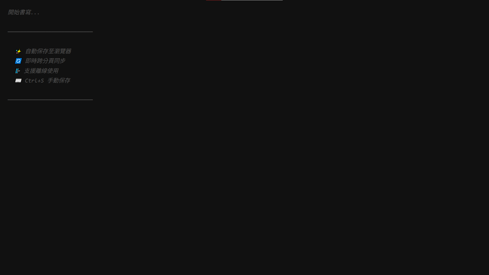

# 📝 Minimalist Notes

> 極簡暗黑筆記本 — 思緒的數位庇護所

[](https://rushiaismywaifu.github.io/minimalist-notes/)
[](LICENSE)



## ✨ 特色

- 🌙 **極簡暗黑主題** — 對眼睛友善
- 💾 **自動保存** — 輸入即儲存，無需手動
- 🔄 **跨分頁同步** — 即時同步所有開啟的分頁
- 📴 **離線可用** — PWA 支援，無網路也能使用
- 📱 **響應式設計** — 手機、平板、桌面都適用
- ⌨️ **快捷鍵支援** — `Ctrl/Cmd + S` 手動保存
- 🔒 **隱私優先** — 資料只存在您的瀏覽器

## 🚀 使用方式

### 線上使用
直接訪問：**[https://rushiaismywaifu.github.io/minimalist-notes/](https://rushiaismywaifu.github.io/minimalist-notes/)**

### 本地運行
```bash
# 克隆專案
git clone https://rushiaismywaifu.github.io/minimalist-notes.git
cd minimalist-notes

# 使用任意 HTTP 伺服器（離線功能需要）
npx serve .
# 或
python -m http.server 8000
```

## 📁 專案結構

```
minimalist-notes/
├── index.html          # 主頁面
├── sw.js               # Service Worker（離線支援）
├── manifest.json       # PWA 設定
├── README.md
├── LICENSE
└── assets/
    ├── icon-192.png
    ├── icon-512.png
    └── screenshot.png
```

## 🛠️ 技術棧

- **純 HTML/CSS/JavaScript** — 零依賴
- **LocalStorage** — 本地持久化
- **Service Worker** — 離線快取
- **PWA** — 可安裝至桌面/手機

## 📄 授權

[MIT License](LICENSE) © 2026

---

<p align="center">
  Made with 🤖 by <b>ChatGPT × Claude AI</b>
</p>